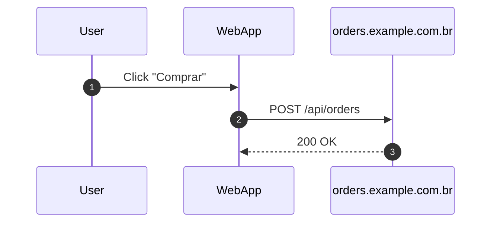

# Chrome Extension (Micro Flow Recorder + Video Capture)

**Capture clicks + API calls + screen video + export JSON + Mermaid diagrams**

A Chrome extension that observes **frontend behavior** during a user journey:

- captures **user clicks**
- captures **all network requests** made by the page
- records a **video of the tab**
- stores **everything in a synchronized timeline**
- exports:
    
    ✔ JSON trace
    
    ✔ tab video (.webm)
    
    ✔ Mermaid sequence diagram
    

---

# **Is it possible?**

Yes — and Chrome provides native APIs for all of it.

✔ 1. Record all network calls (DevTools API)

✔ 2. Capture user interactions (content script)

✔ 3. Record the Chrome tab video (`chrome.tabCapture.capture`)

✔ 4. Merge all events into one timeline

✔ 5. Export JSON

✔ 6. Export Mermaid diagram

Below is the full architecture and implementation.

---

# **Proposed Chrome Extension – Architecture**

```
journey-recorder/
  manifest.json
  background.js
  devtools.html
  devtools.js
  panel.html
  panel.js
  contentScript.js
  video.js
```

Each part has a clear responsibility:

- **DevTools panel → captures network calls**
- **Content script → captures clicks**
- **Video module → captures tab video**
- **Background service worker → event hub + unified timeline**
- **Panel (UI) → Start / Stop / Export JSON / Export Mermaid / Download video**

---

# **manifest.json (with video permissions)**

```json
{
  "manifest_version": 3,
  "name": "Journey Flow Recorder",
  "version": "0.2.0",
  "description": "Record user clicks, API calls, and tab video, then export a Mermaid sequence diagram.",
  "permissions": [
    "storage",
    "tabCapture"
  ],
  "host_permissions": [
    "<all_urls>"
  ],
  "background": {
    "service_worker": "background.js"
  },
  "devtools_page": "devtools.html",
  "content_scripts": [
    {
      "matches": ["<all_urls>"],
      "js": ["contentScript.js"],
      "run_at": "document_end"
    }
  ]
}

```

---

# **background.js – Event Hub + Video Coordination**

```jsx
let isRecording = false;
let events = [];
let eventCounter = 0;

let videoRecorder = null;
let videoChunks = [];
let videoStartedAt = null;

chrome.runtime.onMessage.addListener((msg, sender, sendResponse) => {
  if (!msg || !msg.type) return;

  // ---- START RECORDING ----
  if (msg.type === 'startRecording') {
    isRecording = true;
    events = [];
    eventCounter = 0;

    startVideoRecording();   // <-- NEW

    sendResponse({ ok: true });
    return true;
  }

  // ---- STOP RECORDING ----
  if (msg.type === 'stopRecording') {
    isRecording = false;

    stopVideoRecording();    // <-- NEW

    sendResponse({ ok: true });
    return true;
  }

  // ---- EVENT RECEIVED ----
  if (msg.type === 'addEvent' && isRecording) {
    const now = Date.now();
    events.push({
      id: eventCounter++,
      ts: msg.event.ts || now,
      kind: msg.event.kind,
      ...msg.event
    });
    return;
  }

  // ---- RETURN ALL EVENTS ----
  if (msg.type === 'getTrace') {
    const sorted = [...events].sort((a, b) => a.ts - b.ts);
    sendResponse({
      events: sorted,
      videoStartedAt,
      videoBlob: prepareVideoBlob()
    });
    return true;
  }
});

```

---

# **Video Recording Logic (`startVideoRecording` / `stopVideoRecording`)**

```jsx
function startVideoRecording() {
  chrome.tabCapture.capture({ video: true, audio: false }, (stream) => {
    videoChunks = [];
    videoStartedAt = Date.now();

    videoRecorder = new MediaRecorder(stream, { mimeType: "video/webm" });

    videoRecorder.ondataavailable = e => videoChunks.push(e.data);

    videoRecorder.start();
  });
}

function stopVideoRecording() {
  if (videoRecorder) videoRecorder.stop();
}

function prepareVideoBlob() {
  if (videoChunks.length === 0) return null;
  return new Blob(videoChunks, { type: "video/webm" });
}

```

This produces a `.webm` file synchronized with your event timeline.

---

# **devtools.js – Capture Network Requests**

```jsx
chrome.devtools.panels.create("Flow Recorder", "", "panel.html");

chrome.devtools.network.onRequestFinished.addListener((request) => {
  const req = request.request;
  const res = request.response;

  const event = {
    kind: "request",
    method: req.method,
    url: req.url,
    status: res.status,
    statusText: res.statusText,
    ts: new Date(request.startedDateTime).getTime()
  };

  chrome.runtime.sendMessage({ type: "addEvent", event });
});

```

---

# **contentScript.js – Capture User Interactions**

```jsx
document.addEventListener("click", (event) => {
  try {
    const el = event.target;

    chrome.runtime.sendMessage({
      type: "addEvent",
      event: {
        kind: "click",
        selector: getSelector(el),
        text: (el.innerText || "").trim().substring(0, 80),
        ts: Date.now()
      }
    });
  } catch (err) {}
}, true);

```

Helper for selectors:

```jsx
function getSelector(el) {
  if (!el) return "";
  if (el.id) return `#${el.id}`;
  const tag = el.tagName ? el.tagName.toLowerCase() : "unknown";
  const cls = el.classList?.length ? "." + [...el.classList].join(".") : "";
  return tag + cls;
}

```

---

# **panel.html – Updated UI with Video Download**

```html
<button id="startBtn">Start recording</button>
<button id="stopBtn">Stop recording</button>
<button id="exportJsonBtn">Export JSON</button>
<button id="exportMermaidBtn">Export Mermaid</button>
<button id="downloadVideoBtn">Download Video</button>

<textarea id="output"></textarea>

<script src="panel.js"></script>

```

---

# **panel.js – Export JSON + Mermaid + Video**

```jsx
const startBtn = document.getElementById("startBtn");
const stopBtn = document.getElementById("stopBtn");
const jsonBtn = document.getElementById("exportJsonBtn");
const mermaidBtn = document.getElementById("exportMermaidBtn");
const videoBtn = document.getElementById("downloadVideoBtn");
const output = document.getElementById("output");

startBtn.onclick = () => {
  chrome.runtime.sendMessage({ type: "startRecording" });
};

stopBtn.onclick = () => {
  chrome.runtime.sendMessage({ type: "stopRecording" });
};

jsonBtn.onclick = () => {
  chrome.runtime.sendMessage({ type: "getTrace" }, (res) => {
    const blob = new Blob([JSON.stringify(res, null, 2)], {
      type: "application/json"
    });
    download(blob, "trace.json");
  });
};

videoBtn.onclick = () => {
  chrome.runtime.sendMessage({ type: "getTrace" }, (res) => {
    if (res.videoBlob) download(res.videoBlob, "journey.webm");
  });
};

mermaidBtn.onclick = () => {
  chrome.runtime.sendMessage({ type: "getTrace" }, (res) => {
    const mermaid = generateMermaid(res.events);
    output.value = mermaid;
    download(new Blob([mermaid], { type: "text/plain" }), "flow.mmd");
  });
};

function download(blob, filename) {
  const url = URL.createObjectURL(blob);
  const a = document.createElement("a");
  a.href = url;
  a.download = filename;
  a.click();
  URL.revokeObjectURL(url);
}

```

---

# **Generated Mermaid Output Example**



---

# **Final Output of the MVP**

The MVP now generates *three* artifacts:

1. **Video** (`journey.webm`)
2. **JSON trace** (`trace.json`)
3. **Mermaid diagram** (`flow.mmd`)

Together, these give you:

- Visual replay of the UI
- List of all APIs actually called
- Ordered timeline
- Auto-generated sequence diagram

Perfect for Atlas + façade normalization + decomposition discovery.